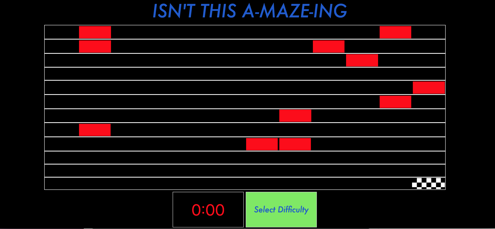
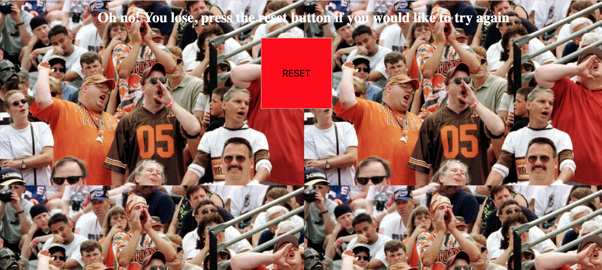

# wdi-project-one

## Isn't this Amazing

link to [My game] (file:///Users/joebyrne/development/wdi-project-one/index.html)

'Isn't this amazing' is a speed and skill based game, with the user attempting to fill the board without touch the red squares. Then you get a score, the lower the score the better. It's fun, competitive and intense.

This was my first project with GA's Web Development course, and my first opportunity to spread my wings with Javascript.

The game consists of three pages:

* Starting Page.
* Game Over Page.
* Winning Page.

# The Starting Page

This starting page consists of an animated title, a flex box, a button and a timer.

# Game Over Page

Once a player starts the game and touches a red square, you lose and come to this page.

# Winning page

If all the squares get highlighted including the the winning page.

# Example of Code

## My Winning Logic

`function NoHighlightedSquaresLeft() {`

`if (container.filter(square => square).length === container.length) {`

`if (container.filter(square => square).length > 142) {`

`const welldone = document.getElementById('wellDone');
welldone.play();
lastPage.style.zIndex = '3';
score.textContent = (`${i}`)``

`;}}`

#
